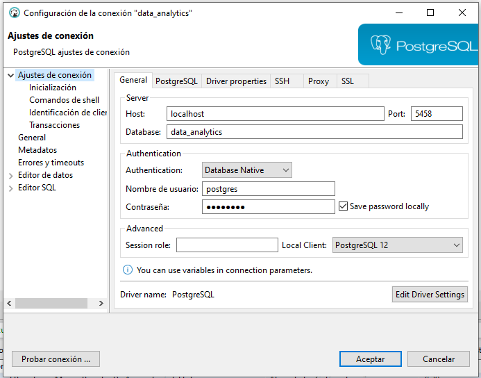
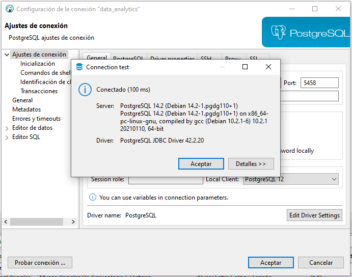

# Alkemy Data Analytics - Challenge

#### Resolución del challenge para Data Analytics de Alkemy. Idea propuesta en el server de Discord de [CodinEric](https://twitter.com/CodinEric)

#### Challenge disponible en [Challenge_Data_Analytics_con_Python](https://github.com/akalautaro/challenge-data-alkemy/blob/main/Challenge_Data_Analytics_con_Python.pdf)

### Instrucciones para ejecución del proyecto

*Los siguientes comandos se ejecutan desde una terminal cmd, powershell, bash o similar.*

- #### Primero hay que crear y ejecutar un virtual environment:
  - `python -m venv venv`
  - `/venv/Scripts/activate` en Windows o `/venv/Scripts/activate.sh` en Linux

- #### Instalar las dependencias necesarias para correr el programa
  - `pip -r install requirements.txt`

- #### Configurar conexión a la base de datos desde el archivo .env 

Para esto hay que editar las siguientes variables según nuestro script `init.sql`:
```
- DB_NAME -> Nombre de la base de datos 
- DB_USER -> Usuario de la base de datos
- DB_PASSWORD -> Contraseña del usuario
- DB_HOST -> Host (por defecto es localhost/127.0.0.1
- DB_PORT -> Puerto (por defecto de Postgres es 5432)
- DATABASE_URL=postgresql://DB_USER:DB_PASSWORD@DB_HOST:DB_PORT/DB_NAME
```

*El archivo .env también contiene la configuración de las URL de los recursos a descargar. Se encuentran almacenados 
en la variable`DATA_DICT`en una lista de diccionarios clave: valor. Por ejemplo, si la url para el archivo de museos
cambiase, dentro de la categoría`museos`habría que editar el valor de la clave`url`.*

### Base de datos

Para la base de datos consideré mejor opción crear la misma con Docker, Docker Compose y un archivo `init.sql` que
contiene las instrucciones para crear la base de datos y las tablas.

En el archivo `docker-compose.yml` lo que hago es crear un contenedor con la imagen de postgres
e indicar que voy a usar el script `init.sql` ubicado en `./database` para crear la base de datos 
y las tablas. También, aprovecho para hacer persistente la información mapeando un volumen local (`./database/pgdata/`)
con el directorio `/var/lib/postgresql/data` que contiene los datos en el contenedor.
Además, hago que el puerto 5458 de mi PC apunte al puerto 5432 del contenedor (ya que en mi caso tenía el puerto por defecto ya ocupado).

#### Ejecutar el contenedor y levantar base de datos

Para esto vamos a necesitar crear el contenedor desde el archivo `docker-compose.yml` ubicado en la raíz del proyecto.
En una terminal corremos el siguiente comando:

`docker-compose up`, o si queremos hacerlo en background `docker-compose up -d`

Si todo salió OK, deberíamos poder conectarnos desde cualquier gestor de bases de datos. En mi caso, utilicé [DBeaver](https://dbeaver.io/) 
que es open source y tiene soporte para conectarse y trabajar con múltiples motores de bases de datos (Sybase, PostgreSQL, Hana, SQL Server, etc).




### Ejecución del programa

Para correr el programa que descarga los archivos, procesa la info y los sube a la base de datos, nos posicionamos dentro de `/src` y ejecutamos:

- `python ./main.py`

El logger está configurado en `/src/logger_base.py` y los logs de la ejecución se almacenan en `./logs/ETL_Process.log`

Tanto la transformación y carga de los datos, como también la conexión a la base PostgreSQL están configurados en el archivo `/src/postgres_client.py`. 

*Tip: Para ejecutar periódicamente este script, se podría utilizar una herramienta para schedulear la ejecución (Tareas programadas en Windows, Cron en Linux), o también AirFlow.*